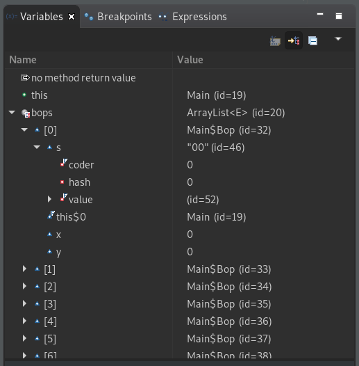

# Debugging

## What is debugging?

Contrary to popular belief, there is more to debugging than just print statements :).

Debugging is a systematic way of tracking down bugs and issues in your code in order to remove them so your code works as expected.

## Vocab

- **Bug**: Any sort of issue or unwanted result in your code. You're probably very familiar with these :)
- **Breakpoint**: A place you mark in your code to tell the debugger to "pause" running your program.
- **Debugger**: A tool that can help you debug code intelligently. It will usually allow you to set breakpoints and inspect things like variables and other values.

## Debugging in Java

We're going to show you how the Java debugger works. We'll be using Eclipse because that's what most students use, but other Java debuggers should work similarly.

Go to https://github.com/utacm/cs101/<link> to download the Java program we'll be practicing on.

## Debugging in Java - continued

Open the project in Eclipse, and click the bug icon next to the play button.

When prompted change to the debug perspective.

Right clicking on a line number provides an option to 'toggle breakpoint'.

A breakpoint tells the debugger to stop program execution once it reaches that line. If you set a breakpoint then click the debug button the program will run until it hits that line.

## Debugging in Java - continued

All the variables in the current scope will be displayed in the 'variables' pane on the right side of the screen.

If the bottom pane there is a tab called 'debug shell'. In this pane you can run arbitrary Java commands while the program is stopped. Type `bar(15);` into this pane, highlight `bar(15);` and click the magnifying glass in the top right corner of the 'debug shell' pane. This will show you the output of the function.

## Debugging in Java - continued

The 'debug shell' pane also allows you to modify variables midway through program execution. Set a breakpoint at the end of the function `baz`. Type `bops.add(new Bop(15, 25, "abc123"));` into the 'debug shell' pane then click the paper with a play button at the top right of the 'debug shell' pane. Notice that in the 'variables' pane `bops` now has 26 element inside it.

The 'debug shell' is incredibly useful for debugging complex programs. Many people are used to the bad habit of 'println' debugging. As programs become larger and more complex the debugger becomes more and more important.

## Questions?
